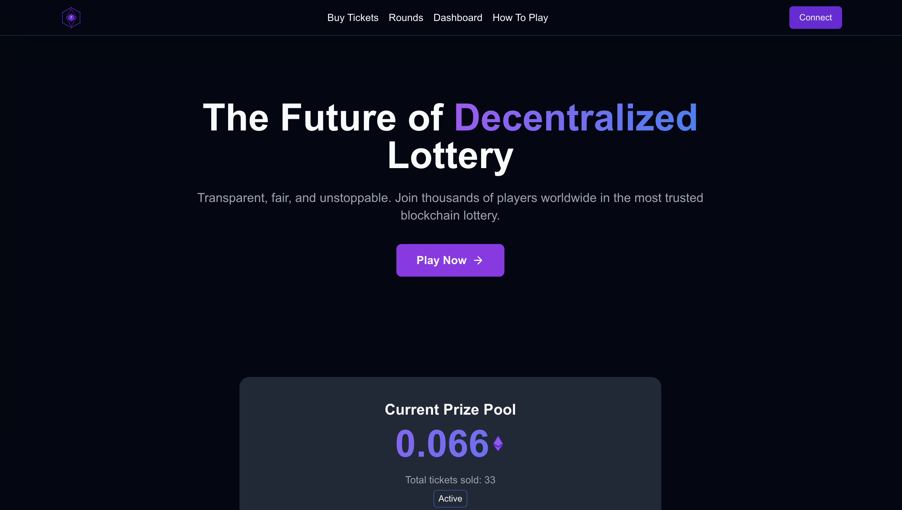
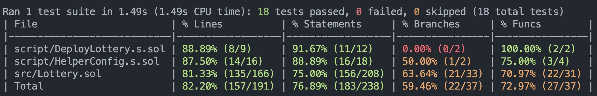

# Leto

Leto is a decentralized full-stack lottery platform built on the Base (Sepolia) blockchain. Players purchase tickets for just 0.0002 ETH, selecting six unique numbers between 1-99. After a 7-day round, winning numbers are generated using Chainlink's Verifiable Random Function, ensuring provable fairness.

## Table Of Content

-   [Leto](#leto)
    -   [Table Of Content](#table-of-content)
    -   [About](#about)
    -   [Technical Implementation](#technical-implementation)
        -   [Smart Contract Architecture](#smart-contract-architecture)
        -   [Key Technical Features](#key-technical-features)
        -   [Front End Development](#front-end-development)
        -   [User Experience](#user-experience)
    -   [Technical Challenges Overcome](#technical-challenges-overcome)
    -   [Testing](#testing)
    -   [Technical Stack](#technical-stack)

## About

Leto is a fully decentralized lottery system running on the Base (Sepolia) blockchain. Leto leverages smart contract to create a transparent, fair, and automated lottery platform where all operations—from ticket purchases to prize distribution—are handled by a smart contract.

## Technical Implementation

### Smart Contract Architecture

-   Developed using Solidity 0.8.26 with a comprehensive state management system
-   Implemented a multi-phase lottery process (Active, Drawing, Registration, Claiming)
-   Integrated Chainlink VRF (Verifiable Random Function) for truly random, verifiable drawing results
-   Utilized Chainlink Automation for managing time-based state transitions without manual intervention
-   Incorporated robust error handling and validation systems for ticket purchases and prize claims

### Key Technical Features

-   Random number generation using Chainlink's VRF to ensure provable fairness
-   Automated round management that extends the lottery if minimum participation thresholds aren't met
-   Two-step winning process requiring winners to actively register tickets, preventing unclaimed prizes
-   Prize pool rollover system when no winners are present
-   Gas-efficient operations using unchecked math operations where appropriate
-   Comprehensive event emission for front-end synchronization

### Front End Development

-   Built with Next.js for server-side rendering and optimal performance
-   Styled using Tailwind CSS for responsive, modern UI design
-   Real-time blockchain interaction through [viem](<[viem](https://viem.sh/)>) and [wagmi](https://wagmi.sh/)
-   User-friendly interfaces for ticket purchases, checking results, and claiming prizes

### User Experience

Users purchase tickets by selecting six unique numbers between 1-99. Each ticket costs 0.002 ETH. The lottery runs in weekly rounds with automated drawing using verifiably random numbers. Winners must register their tickets within a 3-hour window to claim their share of the prize pool, which consists of all ticket purchases minus a small 1% fee.

## Technical Challenges Overcome

-   Implementing secure random number generation on blockchain (solved with Chainlink VRF)
-   Creating automated yet fair round transitions without human intervention
-   Designing an efficient winner verification and prize distribution system
-   Optimizing for gas costs while maintaining complete functionality

## Testing

Import functions in the smart contract have been tested thoroughly using foundry

## Technical Stack

-   Blockchain: Base (Sepolia)
-   Smart Contracts: Solidity
-   Testing Framework: Foundry
-   Frontend: TypeScript, Next.js, TailwindCss, ConnectKit, Viem, Wagmi
-   Backend: Express.js, Redis,
